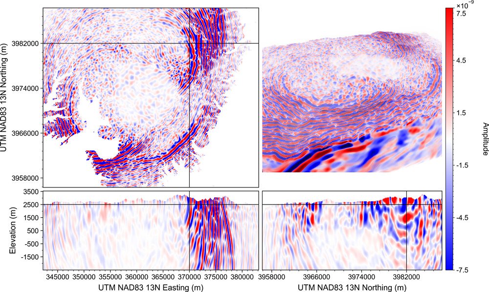
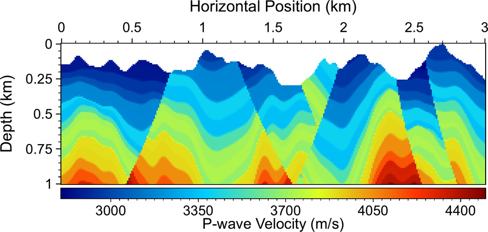
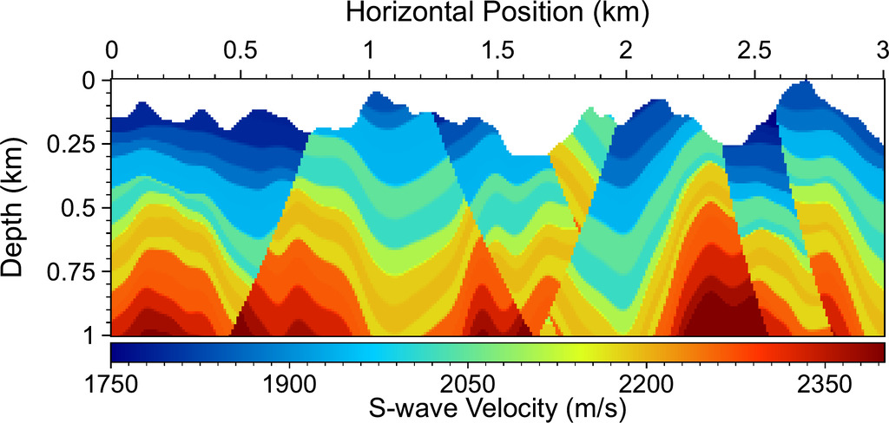
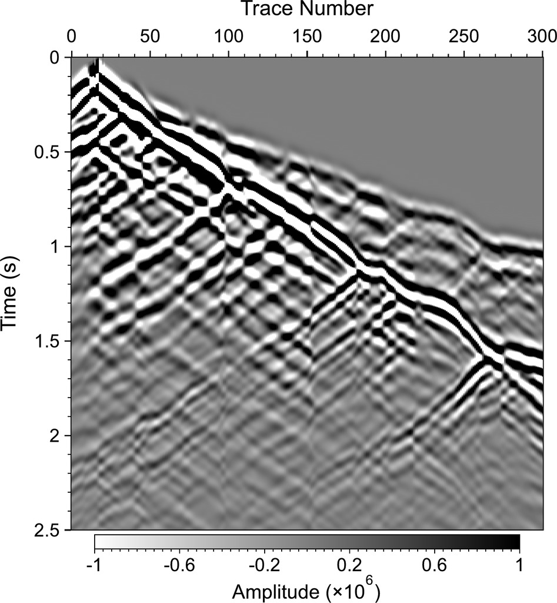
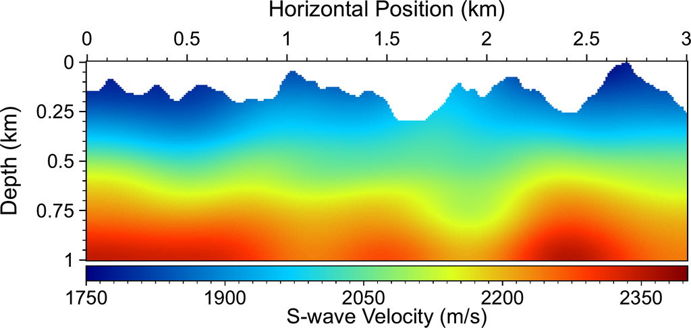
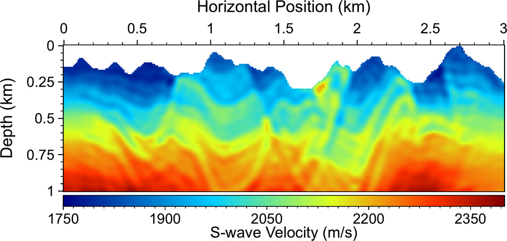
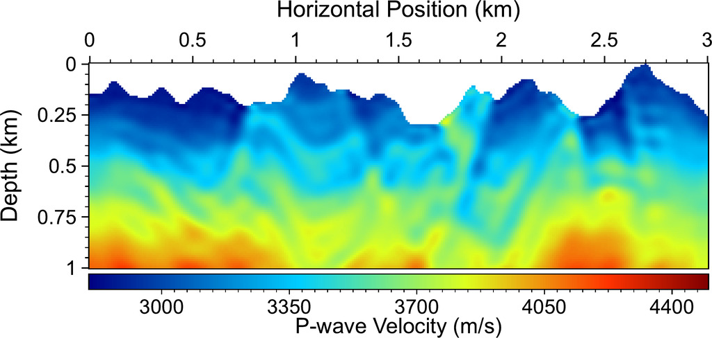
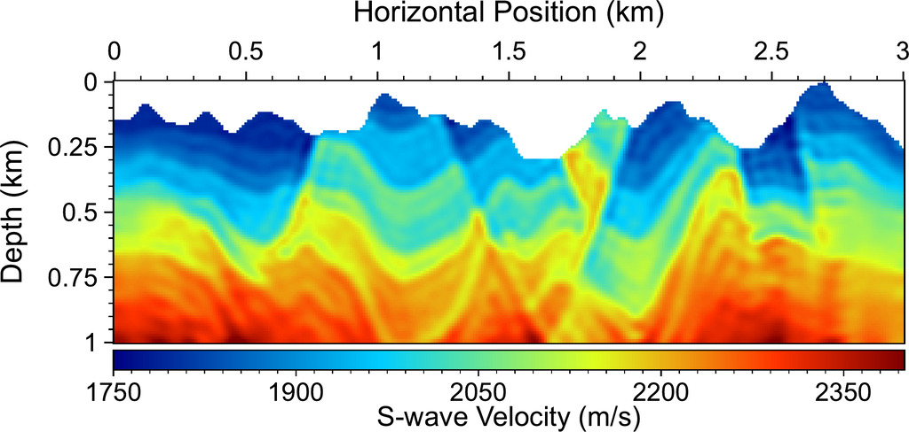

# Description
**OWL: Open Wave Library for seismic wave modeling and full-waveform inversion** 

[](https://doi.org/10.5281/zenodo.20668967)

`OWL` is an open-source package for seismic wave simulation and full-waveform inversion (FWI) in the following types of media: 

- 2D/3D isotropic acoustic media, with or without a flat acoustic free surface at the top. 
- 2D/3D isotropic or simple anisotropic elastic media, with or without a flat elastic free surface at the top. 
- 2D/3D isotropic or general anisotropic elastic media, with or without a flat or topographic elastic free surface at the top. 

Currently, `OWL` does not yet support wave modeling or FWI in: 
- Coupled acoustic-elastic media (i.e., coupled fluid and solid media)
- Visco-acoustic, visco-elastic media
- Poro-elastic, poro-visco-elastic media
- Thermoelastic media
- Unstructured meshes as used by FEM/SEM methods

These features may be included in future development. 

The work was supported by Los Alamos National Laboratory (LANL) Laboratory Directory Research and Development (LDRD) project 20240322ER. LANL is operated by Triad National Security, LLC, for the National Nuclear Security Administration (NNSA) of the U.S. Department of Energy (DOE) under Contract No. 89233218CNA000001. The research used high-performance computing resources provided by LANL's Institutional Computing program. 

The code is released under LANL open source approval reference O4921.

# Requirement
`OWL` depends on [FLIT](https://github.com/lanl/flit).

Some examples in [example](example) use [RGM](https://github.com/lanl/rgm) for generating random geological models and [pymplot](https://github.com/lanl/pymplot) for plotting. 

The code is written in Fortran + MPI + OpenMP. Currently, it can only be compiled with Intel's compiler suite, which is freely available at [Intel HPC Toolkit](https://www.intel.com/content/www/us/en/developer/tools/oneapi/hpc-toolkit.html). 

# Use
To install `OWL`, 

```
cd src
ruby install.rb
```

The compiled `OWL` executables will be in `bin`.

To rebuild, 

```
cd src
ruby install.rb clean
```

We also include several examples in the `example` directory. 

# License
&copy; 2025-2026. Triad National Security, LLC. All rights reserved. 

This program is Open-Source under the BSD-3 License.

Redistribution and use in source and binary forms, with or without modification, are permitted provided that the following conditions are met:

- Redistributions of source code must retain the above copyright notice, this list of conditions and the following disclaimer.
 
- Redistributions in binary form must reproduce the above copyright notice, this list of conditions and the following disclaimer in the documentation and/or other materials provided with the distribution.
 
- Neither the name of the copyright holder nor the names of its contributors may be used to endorse or promote products derived from this software without specific prior written permission.

THIS SOFTWARE IS PROVIDED BY THE COPYRIGHT HOLDERS AND CONTRIBUTORS "AS IS" AND ANY EXPRESS OR IMPLIED WARRANTIES, INCLUDING, BUT NOT LIMITED TO, THE IMPLIED WARRANTIES OF MERCHANTABILITY AND FITNESS FOR A PARTICULAR PURPOSE ARE DISCLAIMED. IN NO EVENT SHALL THE COPYRIGHT HOLDER OR CONTRIBUTORS BE LIABLE FOR ANY DIRECT, INDIRECT, INCIDENTAL, SPECIAL, EXEMPLARY, OR CONSEQUENTIAL DAMAGES (INCLUDING, BUT NOT LIMITED TO, PROCUREMENT OF SUBSTITUTE GOODS OR SERVICES; LOSS OF USE, DATA, OR PROFITS; OR BUSINESS INTERRUPTION) HOWEVER CAUSED AND ON ANY THEORY OF LIABILITY, WHETHER IN CONTRACT, STRICT LIABILITY, OR TORT (INCLUDING NEGLIGENCE OR OTHERWISE) ARISING IN ANY WAY OUT OF THE USE OF THIS SOFTWARE, EVEN IF ADVISED OF THE POSSIBILITY OF SUCH DAMAGE.

# Author
Kai Gao, <kaigao@lanl.gov>

We welcome feedback, bug reports, and improvement ideas on `OWL`. 

If you use this package in your research and find it useful, please cite it as:

* Kai Gao, 2025, OWL: Open Wave Library for seismic wave modeling and full-waveform inversion in acoustic and elastic media, url: [github.com/lanl/owl](https://github.com/lanl/owl)
* Kai Gao, Jackson W. Saftner, Ting Chen, Ryan T. Modrak, 2026, OWL: Open Wave Library for seismic wave modeling and full-waveform inversion in acoustic and elastic media, _under review_ with GJI. 

# Examples
Below are some of the examples included in the under-review paper (LA-UR-26-20025). 

<p align="center">
  
</p>
<p align="center"><strong>Wavefield snapshot in a 3D elastic model with a topographic free surface.</strong> </p>

<p align="center">
  
  <br>
  <br>
  
  <br>
  
  <br>
  
  
</p>
<p align="center"><strong>FWI in an elastic medium with a topographic free surface. From top to bottom: ground-truth Vp and Vs models, simulated data (vz component), models inverted by L2-norm FWI, and models inverted by GWI.</strong> </p>
